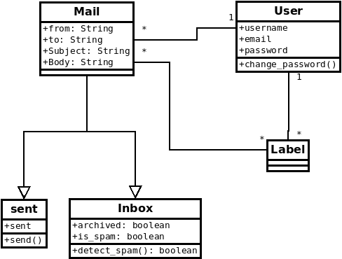

# Diagrama de clases

## Objeto

```
Objeto = Identidad + Estado + Comportamiento
```

Tienen una identidad que no varía. Su estado si cambia con el tiempo. El
comportamiento son las formas en la que dicho estado puede cambiar.

## Clase

Definen objetos

```
Clase = Tipo + Atributos + Métodos
```

Las clases definen un tipo, conjunto de valores. La clase determina la
estructura de los estados a través de los atributos. Los métodos definen los
comportamientos

## ¿Qué describe el diagrama de clases?

### Las relaciones entre objetos.

| Relación        | Explicación              | UML          |
| --------------- | ------------------------ | ------------ |
| Asociación\*    | A está relacionado con B | A ------ B   |
| Agregación      | A es parte de B          | A ------<> B |
| Composición\*\* | A no puede vivir sin B   | A -----<.> B |
| Herencia\*\*\*  | A es B                   | A ---> B     |

\* cada objeto de A está relacionado con B. Ejemplo: los alumnos (A) están en
cursos (B). Las relaciones son inmutables. Ejemplo: A llama a B es mutable (solo
pasa en un momento)
** composición es un caso particular de B. Ejemplo: una carrera no puede vivir
sin la universidad \*** Pensando en las clases como tipos B es subtipo de A

### Cardinalidades

```
A 1----1 B
A 1----* B
A *----1 B
A *----* B
```

1: 1 \* 0 o mas

## Principios de la OO

1. **Bajo acoplamiento**: si una clase depende mucho de otra => mucho acoplamiento. Si se edita una clase se tiene que modificar la otra. Lo mejor es bajo acoplamiento para que se puedan dividir tareas y que sea más mentenible.\*
2. **Alta cohesión**: Tiene que ver con lo que hay **dentro** de la clase. Que todo lo que está en una clase se refiera a lo mismo. Si hay baja cohesión conviene dividir la clase. Así será más legible y ordenado. \*
3. **Única responsabilidad**: cada clase debe tener una única responsabilidad. Que haya una única razón para que esa clase pueda cambiar.
4. **No repetirse uno mismo**: DRY que no se repita en ningún momento dos porciones de código iguales (semánticamente). Que no se repitan **abstracciones**.

\* hay un trade off entre bajo acoplamiento y alta cohesion. Pero con una buena abstracción se pueden mejorar ambos aspectos.

## Ejemplo



## Consejos

### Atributos

Poner nombres de atributos claros y entendibles (no importa si son largos)
No necesariamente hay que poner los tipos siempre. Pero hay veces que no se
sobreentiende, entonces conviene poner el tipo.
Los nombres "estado", "tipo" ; conviene poner el tipo.
Por un tipo de compatibilidad, no usar tipos compuestos como listas, arrays,
diccionarios, etc. (Mejor hacer que sea una relación entre clases para modelar
esto)

### Métodos

Los métodos acceden o modifican ciertos datos. Poner los métodos donde estén
esos datos.
No tiene que ver con lo que _hace_ la clase en el sistema.

### Clases

No tiene que haber una clase _sistema_.
**Herencia**

- no usar herencia cuando los subconjuntos no son excluyentes.

- los objetos no pueden cambiar de clase. No usar herencia en esos casos, sino como una relación diferente o a través de un atributo.

- cuando los hijos de una clase no difieren entre sí o la diferencia es mínima, entonces no hacer una relación de herencia.
