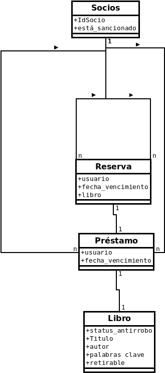

# Práctico 2: Análisis y Especificación de Requerimientos

1-  *¿Qué especifican los requisitos de funcionalidad? ¿Qué otras componentes conforman la especificación de los requisitos del software? Dé al menos dos ejemplos de características que especifiquen cada una de ellas.*  

Los requisitos de funcionalidad especifican todas las funciones que el sistema debe proveer; qué salidas debe producir para cada entrada y las relaciones entre ellas; y las entradas válidas y las verificaciones de validez de la entrada y salida.

La especificación de los requisitos del software también es conformada por los requerimientos de desempeño, restricciones de diseño, requerimientos de interfaces externas.

**Ejemplos:**
Requerimientos sobre funcionalidad
* El sistema debe proveer *x* función.
* Cuando el sistema reciba *x* entrada, debe producir *y* salida.

Requerimientos sobre desempeño
* El sistema debe proveer una respuesta en menos de *x ms*.
* Se deben aceptar *x* usuarios simultáneamente.

Restricciones de diseño
* Se debe seguir *x* estándar para *y* operación.
* Debe ser compatible con *x* sistema.

Requerimientos de interfaces externas
* La interfaz debe tener *x* feature de accesibilidad.
* Debe usarse *x* fuente de tamaño *y*, para que sea legible.

	2- *¿Cuál es el objetivo de realizar el análisis de requisitos?*

Entender al cliente. Descubrir qué se pretende del producto para producir el software. Tener las pautas para generar el SRS correctamente.

3- *¿Cuál es el objetivo de realizar la especificación de los requisitos?*

Tener una especificación concisa establece el contrato entre el cliente y el proveedor respecto a lo que el software va a hacer, es necesario para comprender las necesidades. También funciona como documento legal en caso de que luego de entregado haya malos entendidos, y provee una referencia para la validación del producto final. Y finalmente es necesaria para minimizar cambios y errores en los requerimientos.

4- *¿Qué características debe tener una especificación de requisitos? Enumérelas y describa las dos que considera más importantes. Justifique su elección. Elija tres de las características restantes y explique qué problemas ocurrirían si una especificación no las poseyera.*

1. Correcta
2. Completa
3. No ambigua
4. Consistente
5. Verificable
6. Rastreable
7. Modificable
8. Ordenada en aspectos de importancia y estabilidad

**Dos más importantes**:
* **No ambigua**: Cada requerimiento tiene exactamente un significado. Que no haya cosas subjetivas: "rápido" "lindo" . Si la especificación es ambigua va a llevar a la mayor cantidad de errores porque al tener requerimientos que se pueden interpretar de diversas maneras es posible que el cliente y el desarrollador piensen de formas diferentes y se arrastren errores de requerimientos.
* **Completa**: Todas las características deseadas por el cliente están descritas.   
`cliente -> determina -> SRS`. Si no es **completa** puede haber necesidades del cliente que no estén satisfechas por un error de especificación. Lo cual llevará a tener que rehacer o corregir porciones del software lo cual es caro. Y es posible que tanto cliente como desarrollador terminen pasando una mala experiencia.

* Si no es **modificable**: será mucho más costoso si el cliente desea hacer alguna modificación, lo cual es muy probable que suceda. Pueden ocurrir errores si la especificación de requerimientos no está organizada y ordenada.
*  **Rastreable**:  Es importante para asegurarse que todas las necesidades y los deseos del cliente fueron satisfechos. También podría ocurrir que un cliente desee ver donde está *x* funcionalidad en el código (a punto de ir a juicio) y necesitamos poder mostrarlo.
* **Consistente**: si la especificación se contradice es imposible hacer el proceso de diseño correctamente. 

5- *¿Cuáles son los tipos de errores más comunes en el desarrollo de una especificación de requisitos? Descríbalos brevemente.*

|        Error      | Frecuencia | Descripción |
| ----------------- | --------| ----------- |
|       Omisión     |    30%  | No se describen todos las funcionalidades que el cliente necesitaba.               |
|   Inconsistencia  | 10-30 % | Hay especificaciones que se contradicen.                                           |
| Hechos incorrectos| 10-30 % | Hay puntos en la SRS que no se corresponden con una necesidad o deseo del cliente. |
| Ambigüedad        |  5-20 % | Hay requerimientos que pueden tener más de una interpretación, y cliente y desarrollador no coincidieron. |

6- *¿Es posible contar con un sistema que pueda verificar automáticamente la consistencia de un documento SRS?*
Si, si se utilizan lenguajes formales.
*¿Y que pueda verificar automáticamente su completitud? Justifique su respuesta.*
No, porque eso depende de lo que el cliente dice y de lo que el proveedor interpreta.

7- *¿Es útil contar con métricas en la etapa de análisis de requisitos? Describa brevemente las métricas de tamaño y calidad discutidas en “An Integrated Approach to Software Engineering”(Jalote).*

Si, para poder estimar costos y tiempos, y planear el proyecto se necesita medir el esfuerzo que demandará. 

**Punto función**: define el tamaño en términos de la funcionalidad.
Se determinan diferentes *tipos de funciones*  , la cantidad de cada tipo y para cada una un nivel de complejidad entre *compleja*, *promedio* o *simple*. Se calcula el UFP (punto función no ajustado). Luego, de acuerdo a diferentes características de determina la *complejidad del entorno* y con esa información se calcula el CAF (factor de ajuste de complejidad). Y finalmente el punto función es CAF * UFP.

**Métricas de calidad para evaluar la calidad de la SRS**.
*Métricas de calidad directa*: Evalúan la calidad del documento estimando el valor de los atributos de calidad de la SRS.

*Métricas de calidad indirecta*: Evalúan la efectividad de las métricas de control de calidad usadas en el proceso en la fase de requerimientos. El proceso debe estar bajo control estadístico.

8- *Considere los siguientes problemas, y realice análisis orientado a objetos para cada uno de ellos. Describa además los requisitos funcionales asociados a estos problemas mediante casos de uso*

Se desea desarrollar un sistema informático para **controlar los préstamos** de la biblioteca de una institución.

Los estudiantes y otros usuarios de la biblioteca son los que:
* toman los libros de las estanterías,
* los leen,
* los sacan en préstamo, 
* los devuelven y
* consultan el catálogo de ejemplares disponibles.

Cada **libro** tiene un *código de barras* que lo identifica. Adicionalmente dispone de un *dispositivo electrónico antirrobo* situado debajo del código de barras, siendo el sistema el encargado de activarlo y desactivarlo. 

<!--Caso de uso: obtener un préstamo -->
Cuando un usuario desea obtener en préstamo un libro:
1. se sitúa con él delante del sistema de préstamo. Primeramente pasa por el lector su tarjeta de socio. 
2. A continuación se produce la lectura del código de barras de los libros que desee obtener en préstamo. Si el socio no tiene préstamos vencidos el sistema desbloquea el código antirrobo del libro. En una misma operación se pueden obtener varios libros en préstamo. El proceso termina pulsando un botón de finalización.
<!-- Caso de uso: devolver un libro -->
El procedimiento de devolución de libros funciona de un modo análogo.

<!-- Caso de uso: ser admitido en la biblioteca como socio -->
Para ser admitido en la biblioteca como socio,  un usuario tiene que ser dado de alta por el personal de la biblioteca.
1. A partir de los datos del usuario
2. el sistema genera una tarjeta de socio.

El personal de la biblioteca se encarga de las labores de mantenimiento de libros y de socios, y de las consultas relativas al estado de los **socios** y los **libros**.

Los socios pueden:
* realizar búsquedas sobre el catálogo disponible (por autor, título, palabras clave, etc.).
* Existe un tratamiento uniforme con respecto a la política de préstamos: cada libro que no se devuelva en el plazo estipulado originaría una *sanción* al socio correspondiente.

<!-- Caso de estudio excepcional. socio intenta salir del edificio con un libro bloqueado-->
* En la puerta de salida de la biblioteca existe un *dispositivo de seguridad*; éste se activa bloqueando las puertas en el momento en el que un socio intenta salir del edificio con un libro que tenga el código antirrobo activado.
* Pulsando un botón de emergencia las puertas se desbloquean.

Existen **diferentes tipos de usuarios** con diferentes plazos de devolución de libros. Los **docentes o personal** de la institución pueden retirar libros por un mes, mientras que los **estudiantes** solo pueden hacerlo por una semana.

 En caso que un libro en el cual un cliente está interesado esté prestado, el cliente puede **reservarlo**, en cuyo caso se rechazarán los pedidos de renovación de préstamos que los usuarios de la biblioteca pueden realizar, para extender el plazo de préstamo una vez que éste ha vencido.
 
 La reserva del libro correspondiente se mantiene por 12 horas a partir del momento de devolución. Luego de este tiempo, todos los usuarios de la biblioteca pueden acceder al libro.
 
 Algunos libros son exclusivamente de consulta en la biblioteca, y por lo tanto los usuarios no pueden retirarlos de la biblioteca.

**Casos de uso**
<!--Caso de uso: obtener un préstamo -->
Caso de uso: `Un usuario obtiene un préstamo`
Actor primario: `usuario`
(pre-condición: `el usuario debe ser socio`)
Escenario exitoso principal: 
`paso1: El usuario pasa por el lector su tarjeta de socio`
`paso2: El sistema verifica que el socio no tiene préstamos vencidos, desbloquea el código antirrobo.`
`paso3: el usuario pulsa un botón de finalización`
Escenarios excepcionales: 
`si el socio tiene préstamos vencidos: se le deniega el préstamo`
``
<!-- Caso de uso: devolver un libro -->
Caso de uso: `Un usuario devuelve un libro`
Actor primario: `usuario`
(pre-condición: `el usuario debe ser socio y haber tomado un libro`)
Escenario exitoso principal: 
`paso1: El usuario pasa por el lector su tarjeta de socio`
`paso2: El sistema, bloquea el código antirrobo.`
`paso3: el usuario pulsa un botón de finalización`

<!-- Caso de uso: ser admitido en la biblioteca como socio -->
Caso de uso: `Un usuario es admitido en la biblioteca como socio`
Actor primario: `usuario`
Escenario exitoso principal: 
`paso1: El usuario ingresa sus datos al sistema`
`paso2: El sistema genera una tarjeta de socio`
Escenarios excepcionales: 
`si el usuario ya es socio: se le deniega una nueva tarjeta`

Los socios pueden:
* realizar búsquedas sobre el catálogo disponible (por autor, título, palabras clave, etc.).
<!--Caso de uso: obtener un préstamo -->
Caso de uso: `Un socio realiza una búsqueda sobre el catálogo`
Actor primario: `socio`
Escenario exitoso principal: 
`paso1: El socio introduce autor, título o  palabras clave`
`paso2: El sistema devuelve todas las entradas que coincidan con la búsqueda`

<!-- Duda: se deben incluir casos de uso que forman parte del sistema pero no del software? por ejemplo: persona entra y sale de la biblioteca, para poder hablar del sistema de seguridad -->
<!--Caso de uso: obtener un préstamo -->
Caso de uso: `Un usuario sale de la biblioteca con un libro`
Actor primario: `usuario`
Escenario exitoso principal: 
`paso1: El usuario pasa por la puerta
`paso2: El sistema verifica que el dispositivo de seguridad esté desactivado
Escenarios excepcionales: 
`si el libro tiene el código antirrobo activo: se bloquean las puertas en el momento en el que la persona intenta salir del edificio con el libro (Pulsando un botón de emergencia las puertas se desbloquean).

Se desea desarrollar un sistema informático para la **gestión de las reservas de las habitaciones de un hotel**.

Cada **reserva** estará a nombre de un **cliente**, que proporcionará un *número de tarjeta de crédito* para efectuar el pago. El número de tarjeta de crédito es indispensable para poder realizar la reserva. Se podría reservar *habitación* para cierto *número de días consecutivos*.

Cuando el cliente se presenta para aprovechar la reserva en la fecha de comienzo indicada, el sistema pasa la reserva a la *situación de ocupada*. 

Cuando llega la fecha de terminación de la reserva, o si el cliente solicita la terminación anticipada, el sistema pasa la reserva a la *situación de terminada* y tramita la creación de una **factura**, que se cobrará en general automáticamente de la *tarjeta de crédito* del cliente. El cliente tiene sin embargo la opción de otras *formas de pago* al finalizar la reserva (contado, tarjeta de crédito alternativa, etc.). 

El cliente puede *cancelar una reserva* hasta una semana antes de la fecha inicial, en cuyo caso no se le pasaría al cobro factura alguna. En caso de cancelar la reserva con menos de 7 días de anticipación, se le cobrará de su tarjeta de crédito el valor correspondiente a un día de hospedaje.

Caso de uso: `El cliente cancelar una reserva`
Actor primario: `cliente`
Precondición: `el cliente tiene una reserva` 
Escenario exitoso principal: 
`paso1: el cliente cancela su reserva` 
`paso2: El sistema chequea que se cancele hasta una semana antes de la fecha inicial y elimina la reserva`
Escenarios excepcionales: 
`Si se cancela con menos de 7 días de anticipación, se cobra de la tarjeta de crédito el valor correspondiente a un día de hospedaje`

Caso de uso: `Un cliente reserva una habitación`
Actor primario: `cliente`
Escenario exitoso principal: 
`paso1: El usuario proporciona sus datos, un número de tarjeta de crédito y los días que desea reservar` 
`paso2: El sistema verifica que los datos sean válidos y que haya disponibilidad. Y confirma la reserva`
Escenarios excepcionales: 
`Si no hay disponibilidad o si la tarjeta de crédito no es válida; se muestra un mensaje que describa el error`

Caso de uso: `El cliente se presenta para aprovechar su reserva`
Actor primario: `cliente`
Escenario exitoso principal: 
`paso1: El  cliente especifica su reserva` 
`paso2: El sistema verifica que el cliente haya reservado y coincidan los días. Y pasa la reserva a la situación de ocupada`
Escenarios excepcionales: 
`La reserva del cliente no es correcta: ...`

Caso de uso: `El cliente se termina su estadía`
Actor primario: `cliente`
Precondición: `el cliente tiene una reserva a su nombre` 
Escenario exitoso principal: 
`paso1: El  cliente solicita la terminación anticipada o llega la fecha de terminación de la reserva y especifica (o no) una opción de pago` 
`paso2: El sistema pasa la reserva a la situación de terminada y genera una factura. Si el cliente no especifica una opcion de pago, el sistema automáticamente cobrará de la tarjeta de crédito.`

