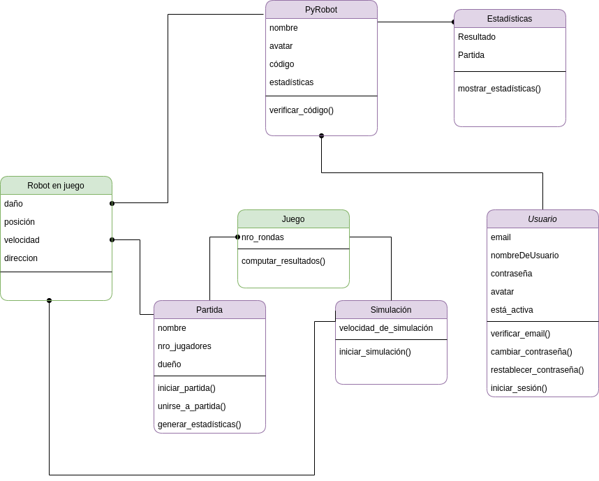

# PyRobots
## Alcance
PyRobots es un juego web. Donde los jugadores pueden programar el comportamiento de sus propios robots, crear, unirse y ejecutar partidas, ver sus estadísticas y ejecutar simulaciones, para las cuales el sistema provee dos bots default,  para ver sus robots en el campo de batalla.
El programa controla un robot cuya misión es buscar, seguir y destruir otros robots, cada uno ejecutando diferentes programas.
Cada robot dispone de funciones para escanear enemigos, iniciar y detener el motor, disparar cañones, etc.
Luego de cada partida el programa mostrará las estadísticas de la misma. Adicionalmente, se pueden ver las estadísticas de cada bot.

### Datos y restricciones
#### Usuario

| Dato | obligatorio | Restricciones |
| - | - | - | - |
| Email | Sí | Ser único. Tener formato de mail |
| Nombre | Sí | Ser único. | 
| Contraseña | Sí | Tener al menos 8 caracteres, al menos una mayúscula, al menos una minúscula y exactamente un guión. |
|  Avatar | No | Ser una imagen. |

#### Simulación

| Dato | Obligatorio  | Restricciones |
| - | - | - | - | 
| Cantidad de rondas | Sí | Ser un número entero entre 1 y 10 000. |
| Bots | Sí | No ser más de 4 bots, ni menos de 2. Ser bots anteriormente subidos por el usuario o los provistos por el sistema.

#### Partida

| Dato                         | Obligatorio | Restricciones                    |
| ---------------------------- | ----------- | -------------------------------- | 
| Nombre                       | Sí          | Ser único.                  | 
| Cantidad de juegos           | Sí          | Ser un número  entero entre 1 y 10 000. | 
| Cantidad de rondas por juego | Sí          | Ser un número entero entre 1 y 200.    |
| Cantidad de jugadores        | Sí          | Ser 2, 3 o 4.                        | 

#### Bot 

| Dato | Obligatorio | Restricciones | 
| -- | --- | -- |
| Nombre | Sí | Ser único
| Avatar | No | Ser una imagen. | 
| Código | Sí | Implementar al menos los métodos `initialize()` y  `response()`. No implementar métodos internos. No tener errores de sintaxis. Cumplir con restricciones de seguridad extra. 

#### Estadísticas asociadas a una partida o simulación.
Por cada jugador se muestra:  
+ **Ranking**.
+ **Nombre** del bot que usó.
+ Porcentaje de **juegos sobrevividos**.
+ Promedio de **rondas sobrevividas** (si el bot ganó y el juego terminó antes de completar las `N` rondas entonces se cuentan todas las rondas restantes como sobrevividas).

El ranking se determina por:  
+ Cantidad de juegos sobrevividos hasta el final.
+ Cantidad de vida promedio al final del juego. %%Va a desempatar ganadores %%
+ Cantidad de rondas promedio que sobrevivió. %% Va a desempatar perdedores %%
+ Si todavía hay un empate entonces tienen el mismo número de ranking.

#### Estadísticas asociadas a un bot
Un jugador puede ver las estadísticas de su bot. En ellas, se encuentra la siguiente información:
+ Cantidad total de **partidas jugadas**.
+ Porcentaje de **partidas ganadas** (con número de ranking 1, las partidas donde todos los bots obtuvieron el mismo ranking se considera que todos ganaron).
+ Porcentaje de **partidas perdidas** (con menor número de ranking).
+ Valor medio de **ranking**.

#### Estadísticas generales
+  Por cada bot se ve la cantidad de partidas jugadas y el porcentaje de ganadas y perdidas.
%% el objetivo es poder compararlos %%

 # Casos de uso
A continuación se especifican 6 casos de uso. Los conjuntos y validaciones de datos se pueden ver detalladas en la sección de Alcance.
 
## 1 Registrarse
+ **Caso de uso:** Registrarse
* **Actor principal:** Usuario no registrado.
* **Pre-condición:** El usuario no está logueado.
+ **Escenario exitoso:** 
	1. El usuario ingresa sus datos.
	2. El sistema verifica la validez de los datos, y envía un mail de verificación.
	3. El usuario, recibe el mail y lo verifica.
	4. El sistema registra efectivamente al nuevo usuario y muestra una confirmación.
+ **Escenarios excepcionales:**
	+ El usuario no ingresa algún dato obligatorio: El sistema le informa qué campo debe completar.
	+ El usuario ingresa un dato con un formato incorrecto:  El sistema le informa qué campo debe corregir.
	+ El usuario ingresa un mail que ya fue registrado: Se le informa que ya tiene un usuario en la plataforma con ese mail.
	+   El usuario ingresa un nombre de usuario que ya fue registrado: Se le informa que ese nombre de usuario ya está tomado.

## 2 Cambiar Password
+ **Caso de uso:** Cambiar password
+ **Actor principal:** Usuario
+ **Pre-condición:** El usuario debe estar logueado
+ **Escenario exitoso:**
	1. El usuario emite una solicitud de cambio de contraseña. Para ello ingresa su contraseña actual y la nueva contraseña junto con una confirmación de la misma.
	2. El sistema verifica que la contraseña nueva sea igual a su confirmación. Verifica que el formato sea válido. Informa que el cambio de contraseña fue exitoso. Y envía un mail al usuario notificando el cambio de contraseña.
+ **Escenarios excepcionales:**
	+ El usuario ingresa mal su contraseña actual: Se le informa del error y se le permite intentar de nuevo.
	+ El usuario ingresa una contraseña nueva inválida, o la confirmación de la nueva contraseña no es correcta: Se le informa del error y se le permite intentar de nuevo.

## 3 Ejecutar Simulación
+ **Caso de uso:** Ejecutar simulación
+ **Actor principal:** Usuario
+ **Pre-condición:** El usuario debe estar logueado
+ **Escenarios exitosos:**
	1. El usuario inicia una simulación ingresando los parámetros de la simulación.
	2. El sistema verifica la validez de los datos ingresados, genera el tablero, posiciona aleatoriamente los bots en este y reproduce la pelea de bots que se muestra en tiempo real hasta completar la cantidad de rondas pautadas. Una vez completada, el sistema genera y muestra las estadísticas de los resultados de la simulación.
+ **Escenarios excepcionales:** 
	+ No es válida la cantidad de rondas o la cantidad de bots: Se le informa al usuario del error y se le permite volver a intentar.

## 4 Crear una Partida
+ **Caso de uso:** Crear una partida.
+ **Actor principal:** Usuario
+ **Pre-condición:** El usuario debe estar logueado.
+ **Escenario exitoso:**
	1. El usuario ingresa  los datos de la partida y especifica cuál de sus robots quiere usar.
	2. El sistema crea la partida, queda disponible en la lista de partidas. Y muestra una confirmación de que se creó con éxito.
+ **Escenarios excepcionales:**
	+ No se completan especifican todos los datos de la partida: El sistema informa al usuario los campos faltantes y le permite volver a intentar.
	+ Alguno de los datos no es válido: Se le informa al usuario del error y se le permite volver a intentar.

## 5 Ejecutar Partida
+ **Caso de uso:** Ejecutar partida
+ **Actor principal:** Usuario
+ **Pre-condición:** El usuario debe estar logueado. El usuario creó una partida que actualmente se encuentra llena.
+ **Escenarios exitosos:** 
	1. El usuario solicita ejecutar la partida.
	2. El sistema computa los resultados de los juegos, y muestra las estadísticas de la partida. El sistema también actualiza las estadísticas de todos los bots que participaron. 

## 6 Subir un bot
+ **Caso de uso:** Subir un bot.
+ **Actor principal:** Usuario.
+ **Pre-condición:** El usuario debe estar logueado.
+ **Escenarios exitosos:**
	+ El usuario ingresa la información necesaria.
	+ El sistema verifica que la información esté completa y sea válida; agrega el bot en la lista de bots del usuario e inicializa las estadísticas. Finalmente informa al usuario que se subió el bot correctamente.
+ **Escenarios excepcionales:**
	+ El bot subido tiene algún campo no válido: Se le informa al usuario del error y se le permite corregirlo.
	+ El usuario no completó todos los datos obligatorios: El sistema  le informa el campo faltante y le pide que lo ingrese.

# Diagrama de clases 

# DFD
Cuando no se especifiquen todos los datos y solo se exprese "datos de..." o "estadísticas de..."  se pueden consultar los detalles en la sección de datos y restricciones.

